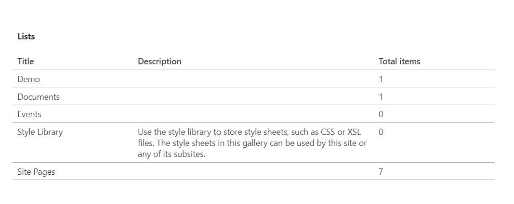
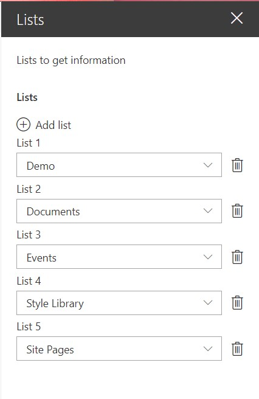

## spfx-custom-property-pane

Display lists information, the lists are configured in a custom property pane. It stores an array of strings with the list ids.
This is an example how create a custom property pane using multiples dropdown, but it can be any type of structure required.

### Webpart

Webpart rendered.

### Configuration

In the follwing image you will see multiple lists selected from the current web.
You can select 1 or many lists in the configuration.

